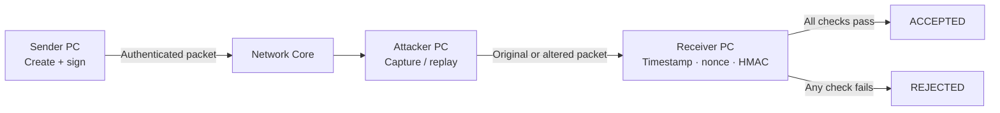

<div align="center">

# SecureTX Lab

### Replay Attack Demonstration &amp; Prevention

An interactive cybersecurity lab where signed transactions move between a sender, an attacker, and a receiver.


**BCS703 · Cryptography &amp; Network Security**


</div>

---

## Inside The Lab

Three interactive workstation screens and a central network core make each stage visible. Hover or focus a workstation on desktop, or tap it on mobile, to inspect its activity.



The process rail, packet animation, workstation terminals, receiver checks, network telemetry, and event log update as you run scenarios.

## Quick Start

No package installation or build step is needed. From the project folder, start a local server:

```powershell
python -m http.server 8000
```

Open [localhost:8000](http://localhost:8000/) in a modern browser. Stop the server with `Ctrl+C`.

## Run A Demonstration

1. Hover or focus a workstation to preview it; click or tap a PC to open its enlarged screen. Close it with the close button or `Escape`.
2. Choose **Generate** to create a transaction and its authentication tag.
3. Choose **Send transaction** to watch the packet cross the lab.
4. Use **Replay transaction**, **Modify message**, or **Expire transaction** to demonstrate a rejection.
5. Choose **New valid transaction** to create and verify a fresh packet.
6. Choose **Reset lab** to clear the in-memory simulation state.

The attacker monitor also includes **Replay captured packet**. It becomes available after a transaction has been accepted.

## Test Scenarios

| Test | Receiver checks | Expected outcome |
|:--|:--|:--|
| Normal authenticated transaction | Timestamp, nonce, HMAC pass | **Accepted** |
| Replay an accepted transaction | Nonce fails | **Rejected · replay detected** |
| Change message, retain original HMAC | HMAC fails | **Rejected · invalid authentication** |
| Send a timestamp older than 10 seconds | Timestamp fails | **Rejected · message expired** |
| Create a new transaction with a fresh nonce | All checks pass | **Accepted** |

Run each case from the **Scenario tests** table to see its result reflected across the workstations.

## Security Model

- HMAC-SHA256 is generated with the browser's Web Crypto API over `message|timestamp|nonce`.
- Nonces use `crypto.getRandomValues()` and accepted values are tracked in the in-memory `usedNonces` set.
- A transaction is accepted only when its timestamp is within 10 seconds, its nonce has not been used, and its HMAC matches.
- Reset clears the in-memory nonce history. This is an educational, client-side demonstration, not a persistent or production replay-prevention service.

## Project Structure

| File | Purpose |
|:--|:--|
| `index.html` | Workstations, operator controls, scenario tests, and live readouts |
| `style.css` | Lab environment, workstation visuals, responsive layout, and packet motion |
| `script.js` | Web Crypto operations, verification, scenario handlers, and live screen state |

